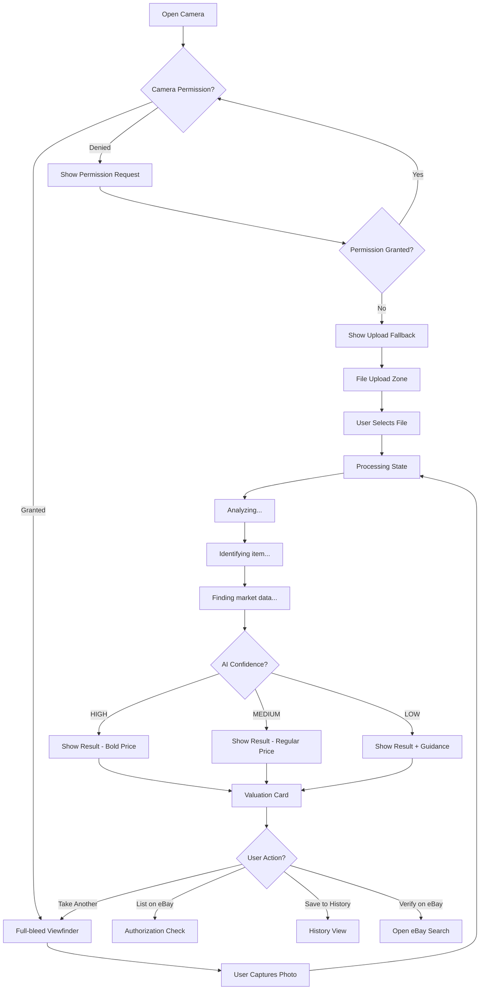
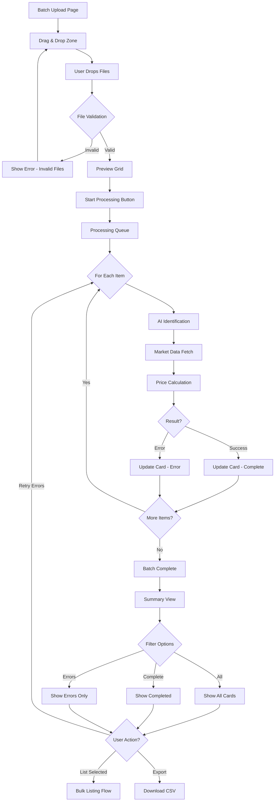
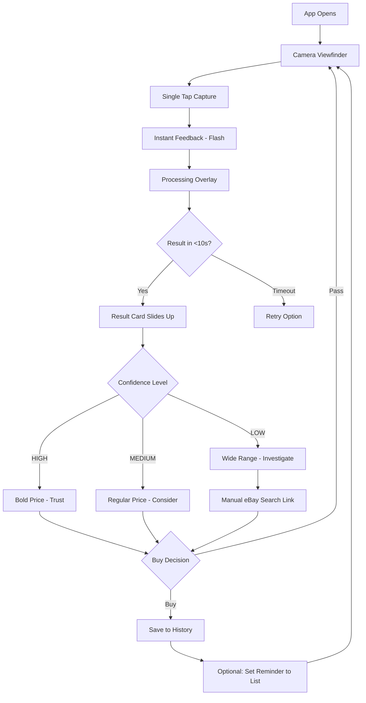
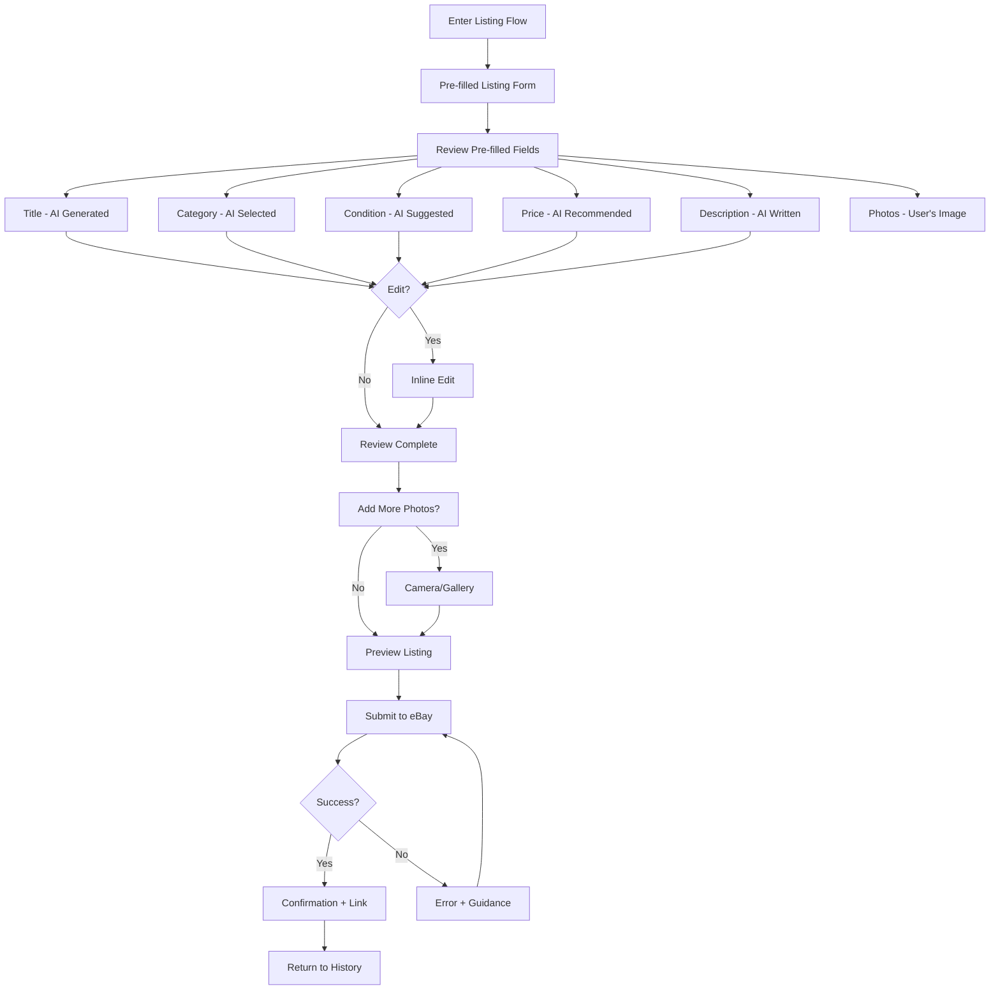
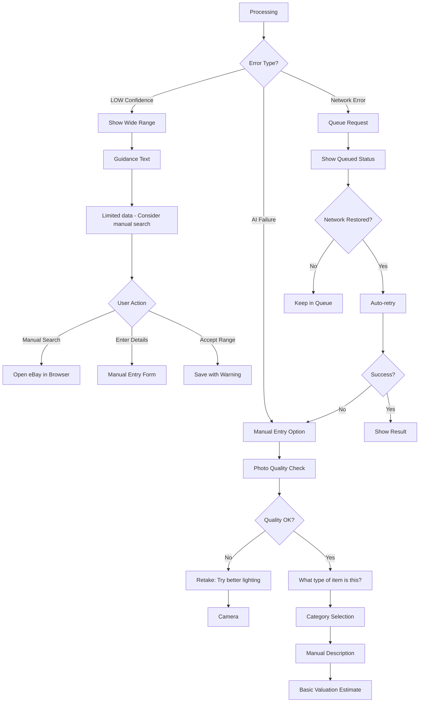

# UX Design Specification valuesnapapp

**Author:** Elawa
**Date:** 2025-12-10

---

<!-- UX design content will be appended sequentially through collaborative workflow steps -->

## Executive Summary

### Project Vision

ValueSnap is an AI-powered platform that eliminates the two biggest barriers to reselling: not knowing an item's value and not knowing how to list it effectively. The core user journey is **Photo → Value → List** in minutes, not hours.

From a UX perspective, ValueSnap transforms an overwhelming task (clearing a 200-item inherited collection) into manageable progress—one photo at a time. No expertise required. No hours of research. Just capture, value, and list.

The platform combines accurate market data valuation (70-80% accuracy with transparent confidence indicators) with frictionless listing creation, serving individuals who need to convert items into cash—primarily estate sellers clearing inherited collections, and secondarily casual collectors and thrift shoppers.

**When AI is uncertain, users aren't abandoned:** For items where market data is limited or identification confidence is low, ValueSnap transparently flags uncertainty and provides manual review options—guiding users rather than failing silently.

### Target Users

**Primary: Estate Sellers (Sarah, 58)**
- Inherited 200-item collections needing quick clearing
- Moderate tech comfort, time pressure, desktop-focused workflow
- Needs: Batch processing, progress tracking, confidence indicators, pre-filled listings
- Success: Clear 100+ items efficiently without underpricing
- UX Priority: Desktop batch review interface, trust-building transparency

**Secondary: Casual Collectors/Thrift Shoppers (Alex, 28)**
- Finds 5-15 items/week, mobile-first, price-sensitive
- Needs: Fast valuations (<10s), buy/pass decisions, quick listing flow
- Success: List an item in ~2 minutes, sell at target price
- UX Priority: Mobile camera-first experience, instant valuation feedback

**Secondary: eBay Power Sellers (Lisa, 45)**
- 50-100 listings/week, accuracy-focused, desktop workflow
- Needs: Accuracy validation, pricing guidance, template compatibility
- Success: Consistent pricing that matches sold outcomes
- UX Priority: Accuracy validation tools, expert verification workflow

### Key Design Challenges

**1. Trust Progression UX**
- **Challenge**: Users start skeptical, need to verify early valuations to build trust
- **UX Need**: Design for Skeptical → Semi-Trust → Earned Trust progression
- **Complexity**: Confidence indicators must be instantly scannable; LOW confidence should guide, not discourage
- **Solution**: Typography-driven confidence communication (Bold/Regular/Light weights), transparent sample sizes, manual review options

**2. Mobile-First Camera Workflow**
- **Challenge**: Camera capture is core to the experience, but desktop users need file upload fallback
- **UX Need**: Seamless camera experience on mobile, graceful fallback on desktop
- **Complexity**: Safari camera quirks, permission handling, photo quality detection
- **Solution**: Full-bleed viewfinder on mobile, constrained upload interface on desktop, consistent Swiss Minimalist aesthetic

**3. Batch Processing UX**
- **Challenge**: Estate sellers process 50+ items; need progress tracking and per-item status visibility
- **UX Need**: Efficient review interface for 20+ items, filter by status, partial success handling
- **Complexity**: Sequential processing with progress indication, error recovery per item
- **Solution**: Swiss grid-based batch review interface, status filters, progress indicators

**4. Responsive Design Excellence**
- **Challenge**: Flawless visual transitions from mobile to desktop without layout deadlock
- **UX Need**: Elegant, predictable responsive behavior that maintains Swiss Minimalist precision at every screen size
- **Complexity**: Ensuring mathematical grid relationships persist across all breakpoints
- **Solution**: 12-column modular grid with mathematical collapse (12 → 6 → 4 → 3 columns), explicit breakpoints, proportional spacing

**5. Data-First Presentation**
- **Challenge**: Swiss Minimalist design requires numbers/prices prominent, confidence clear, no decorative elements
- **UX Need**: Typography-driven hierarchy, mathematical grid alignment, active negative space
- **Complexity**: Balance information density with white space, make confidence instantly scannable
- **Solution**: Typography weight hierarchy (Bold/Regular/Light), grid-based card patterns, micro-text details

**6. Pre-Filled Listing Flow**
- **Challenge**: Users need to distinguish pre-filled vs manual fields, edit before listing
- **UX Need**: Clear visual distinction, easy editing, maintain trust in AI accuracy
- **Complexity**: Show what's AI-generated vs user-editable, prevent over-editing
- **Solution**: Visual distinction for AI-generated content, inline editing, clear save/submit actions

### Design Opportunities

**1. Confidence Communication Innovation**
- **Opportunity**: Use typography weight (Bold/Regular/Light) instead of color for confidence levels
- **Impact**: Authentic Swiss Minimalist approach, builds trust through clarity
- **Innovation**: HIGH confidence = Bold typography, MEDIUM = Regular, LOW = Light—pure typographic hierarchy

**2. Valuation Card Pattern**
- **Opportunity**: Create signature card pattern—photo, name, price range (bold/large), confidence + sample size (caption)
- **Impact**: Consistent, scannable, data-first presentation
- **Innovation**: Swiss grid-based card with asymmetric balance, no decorative borders, mathematical spacing

**3. Batch Review Interface**
- **Opportunity**: Grid/list hybrid for reviewing 20+ items efficiently
- **Impact**: Estate sellers can process batches quickly, filter by status
- **Innovation**: Swiss grid layout with status indicators, filter controls, bulk actions

**4. Trust-Building Transparency**
- **Opportunity**: Show sample size, data sources, statistical methods transparently
- **Impact**: Users verify early, build trust through transparency
- **Innovation**: Micro-text details (Swiss style) showing "Based on 47 recent sales" vs "Based on 3 sales"

**5. Mobile Camera-First Experience**
- **Opportunity**: Full-bleed viewfinder, single capture button, results appear post-capture
- **Impact**: Optimized for moment of inspiration, feels native
- **Innovation**: Minimal UI chrome, high-contrast capture button, Swiss precision

**6. Flawless Responsive Architecture**
- **Opportunity**: Swiss Minimalist design is inherently responsive due to mathematical grid structure
- **Impact**: Elegant transitions at every screen size, no layout deadlock
- **Innovation**: 12-column modular grid with mathematical collapse, fluid spacing, typography hierarchy that scales predictably

## Core User Experience

### Defining Experience

The core user experience for ValueSnap is defined by the **Photo → Value → List** loop—the primary action that eliminates the two biggest barriers to reselling. Users capture a photo, receive an instant valuation with transparent confidence indicators, and create a pre-filled listing in minutes, not hours.

**The Core Loop:**
1. **Capture**: Mobile camera-first or desktop file upload
2. **Value**: Instant AI-powered identification + market data valuation (<10s)
3. **Review**: Transparent confidence levels (HIGH/MEDIUM/LOW) + sample sizes
4. **List**: Pre-filled eBay listing (6 of 8 fields) with one-tap creation

This core loop transforms overwhelming tasks (clearing 200-item collections) into manageable progress—one photo at a time. No expertise required. No hours of research. Just capture, value, and list.

### Platform Strategy

**Mobile-First PWA (Progressive Web App)**

ValueSnap is built as a mobile-first PWA that serves all platforms through a single codebase (Expo Router + React Native Web + NativeWind/Tailwind).

**Platform Priorities:**
- **Primary**: Mobile (camera-first for casual collectors/thrift shoppers)
- **Secondary**: Desktop (batch processing for estate sellers)
- **Tertiary**: Tablet (responsive adaptation of mobile/desktop experiences)

**Platform Capabilities:**
- **Mobile**: Web Camera API for photo capture, touch-based interactions, add-to-homescreen PWA install
- **Desktop**: File upload/batch processing, mouse/keyboard interactions, detailed review interfaces
- **Offline**: Cached appraisals viewable without internet, request queuing for network resilience

**Responsive Design Approach:**
- Swiss Minimalist 12-column modular grid with mathematical collapse (12 → 6 → 4 → 3 columns)
- Explicit breakpoints (mobile/tablet/desktop/wide) for predictable, maintainable responsive behavior
- Flawless transitions at every screen size, no layout deadlock

### Effortless Interactions

**1. Camera Capture**
- **Mobile**: Full-bleed viewfinder, single tap capture, instant processing feedback
- **Desktop**: Drag-and-drop file upload, batch processing support
- **Natural**: No complex settings, just point and shoot—feels native, not web-based

**2. Instant Valuation**
- **Speed**: <10 seconds from photo to price range with confidence level
- **Transparency**: Sample size shown ("Based on 47 recent sales"), confidence level immediately visible
- **Zero Thought Required**: Users see price, confidence, and sample size instantly—no interpretation needed

**3. Pre-Filled Listing Creation**
- **Efficiency**: 6 of 8 eBay fields pre-filled (title, category, condition, pricing, description, photos)
- **User Control**: Users review and adjust, not create from scratch
- **One-Tap Listing**: Connect eBay once (OAuth), list with minimal effort

**4. Trust Progression**
- **Skeptical Phase**: Encourage verification, show transparency, don't demand blind trust
- **Semi-Trust Phase**: Confidence indicators guide selective verification
- **Earned Trust Phase**: Users trust HIGH confidence automatically, verify MEDIUM/LOW selectively

### Critical Success Moments

**1. First Accurate Valuation (Activation)**
- **Moment**: User verifies first valuation against eBay, finds it accurate
- **Impact**: "This AI actually works" → trust begins, user continues
- **Design Requirement**: Make verification easy, show confidence transparently, encourage early verification

**2. High-Value Discovery**
- **Moment**: User finds item worth $200+ they thought was worthless
- **Impact**: "I almost donated this" → immediate value realization, platform proves worth
- **Design Requirement**: Highlight high-value items, suggest professional appraisal for $500+ items

**3. Batch Processing Success**
- **Moment**: Estate seller processes 50 items efficiently with progress tracking
- **Impact**: "I cleared my collection in 6 weeks" → time saved, task manageable
- **Design Requirement**: Progress tracking, status filters, partial success handling, efficient review interface

**4. Listing Completion**
- **Moment**: User lists item in 2 minutes instead of 10 minutes
- **Impact**: "This is so much faster" → friction reduction, platform efficiency proven
- **Design Requirement**: Pre-filled fields, clear edit/save actions, one-tap listing, minimal steps

**5. Trust-Building Transparency**
- **Moment**: User sees LOW confidence, appreciates honesty, uses manual review options
- **Impact**: "They're not pretending to know" → trust through transparency, not blind AI confidence
- **Design Requirement**: Clear confidence indicators, manual review options, guidance not failure

### Experience Principles

**1. Trust-Through-Transparency**
- Show confidence levels, sample sizes, data sources explicitly
- Encourage early verification, don't demand blind trust
- Guide users when uncertain, don't fail silently
- Build trust through honesty, not perfection

**2. Swiss Minimalist Precision**
- Mathematical grid structure (12-column modular grid)
- Typography-driven hierarchy (weight + scale, not decoration)
- Data-first presentation (numbers prominent, confidence clear)
- Active negative space (spacing as structural element, not empty)

**3. Effortless Flow**
- Photo → Value → List in minutes, not hours
- Eliminate barriers: no expertise required, no hours of research
- Pre-fill everything possible, users review and adjust
- Reduce cognitive load: show what matters, hide what doesn't

**4. Mobile-First, Desktop-Optimized**
- Mobile: Camera-first, instant valuation, quick listing
- Desktop: Batch processing, detailed review, efficient workflows
- Responsive: Flawless transitions at every screen size, no layout deadlock
- Platform-appropriate: Optimize for each use case, don't force one layout everywhere

**5. Graceful Degradation**
- Handle AI uncertainty with transparency (confidence indicators, manual review)
- Handle technical failures with resilience (request queuing, offline support)
- Never lose user's work: queue requests, cache appraisals, preserve state
- Guide users through problems, don't just show error messages

## Desired Emotional Response

### Primary Emotional Goals

**1. Empowered and In Control**
- Users transform overwhelming tasks (200-item collections) into manageable progress
- One photo at a time, no expertise required
- Users feel capable, not overwhelmed

**2. Confident and Informed**
- Transparent confidence indicators (HIGH/MEDIUM/LOW) build trust
- Sample sizes shown ("Based on 47 recent sales")
- Users feel informed, not guessing

**3. Relieved and Validated**
- Finding value in items they thought were worthless
- "I almost donated this" → immediate value realization
- Users feel validated, not regretful

**4. Efficient and Productive**
- Listing in 2 minutes instead of 10 minutes
- Batch processing saves hours of research
- Users feel productive, not stuck

**5. Curious and Engaged**
- Emotional hook that gets users to try ValueSnap
- "I wonder what this is worth?" drives first photo
- Anticipation builds engagement

**6. Calm and Focused**
- Reducing stress, not adding to it
- "One photo at a time" breaks overwhelming tasks
- Users feel calm, not rushed

**7. Proud and Accomplished**
- Accomplishments shown through data, not celebration
- "50 items valued" → pride through numbers
- Users feel proud of their progress

### Emotional Journey Mapping

**Discovery (First Use):**
- **Overwhelm**: "I have 200 items to clear"
- **Fear**: "I'm worried I'll make a mistake"
- **Curiosity**: "But what if this helps?"
- Design: Clear value proposition, easy first step, encourage verification

**Core Experience (Valuation):**
- **Calm**: "One photo at a time, I can do this"
- **Anticipation**: "Processing... let me see what AI finds"
- **Surprise**: "Wait, it's worth $200?"
- **Relief**: "Oh, I can verify this"
- **Validation**: "I was right to check this item"
- Design: Instant feedback, transparent confidence, easy verification

**Trust Building (Verification):**
- **Relief**: "Oh, I can verify this"
- **Trust**: "I've verified, it's accurate"
- **Confidence**: "I can trust HIGH confidence valuations"
- Design: Make verification easy, show confidence transparently, encourage early verification

**Success Moments (High-Value Discovery):**
- **Relieved**: "I almost donated this $200 item"
- **Excited**: "This is worth more than I thought"
- **Empowered**: "I'm making smart decisions"
- Design: Highlight high-value items, celebrate discoveries

**Completion (Listing Created):**
- **Accomplished**: "I listed this in 2 minutes"
- **Efficient**: "This is so much faster than before"
- **Productive**: "I'm making progress"
- Design: Clear completion states, progress indicators, time saved messaging

**Return Usage (Trust Earned):**
- **Trusting**: "I trust HIGH confidence automatically"
- **Efficient**: "I can process items quickly now"
- **Confident**: "I know when to verify and when to trust"
- **Proud**: "I've valued 50 items" (shown through data)
- Design: Streamlined flows for trusted users, maintain transparency, show accomplishments through data

### Complete Emotional Arc

**The Full Journey:**
1. **Overwhelm** → "I have 200 items to clear"
2. **Fear** → "I'm worried I'll make a mistake"
3. **Curiosity** → "But what if this helps?"
4. **Calm** → "One photo at a time, I can do this"
5. **Relief** → "Oh, I can verify this"
6. **Trust** → "I've verified, it's accurate"
7. **Empowerment** → "I can do this efficiently now"
8. **Pride** → "I accomplished something significant" (shown through data)

### Micro-Emotions

**Overwhelm vs. Clarity:**
- Goal: Users feel clear about next steps, not overwhelmed by the task
- Design: Break overwhelming tasks into single actions ("Take a photo"), show progress through data
- Avoid: Showing all 200 items at once, unclear next steps

**Fear vs. Security:**
- Goal: Users feel secure in their decisions, not afraid of making mistakes
- Design: Show control immediately ("You can verify this"), provide manual review options prominently
- Avoid: Overconfident AI, hidden limitations, demanding trust

**Curiosity vs. Apathy:**
- Goal: Users feel curious to try ValueSnap, not apathetic
- Design: Effortless first step ("Just snap a photo"), show processing feedback, create anticipation
- Avoid: Complex onboarding, unclear value proposition

**Calm vs. Stress:**
- Goal: Users feel calm and focused, not stressed
- Design: One photo at a time, progress through data, generous spacing, clear hierarchy
- Avoid: Overwhelming interfaces, unclear progress, rushed interactions

**Confidence vs. Confusion:**
- Goal: Users feel confident in valuations, not confused by uncertainty
- Design: Clear confidence indicators, sample sizes, manual review options
- Avoid: Vague language, hidden uncertainty, false confidence

**Trust vs. Skepticism:**
- Goal: Build trust through transparency, not demand blind faith
- Design: Encourage early verification, show data sources, guide when uncertain
- Avoid: Overconfident AI, hidden limitations, demanding trust

**Relief vs. Regret:**
- Goal: Users feel relieved they checked, not regretful they didn't
- Design: Highlight high-value items, suggest professional appraisal for $500+
- Avoid: Missing valuable items, false negatives

**Efficiency vs. Frustration:**
- Goal: Users feel efficient and productive, not frustrated by friction
- Design: Pre-filled listings, one-tap actions, progress tracking
- Avoid: Multiple steps, unclear actions, lost work

**Pride vs. Shame:**
- Goal: Users feel proud of accomplishments, not ashamed of mistakes
- Design: Show accomplishments through data ("50 items valued"), highlight milestones
- Avoid: Celebratory animations, boastful messaging, hiding mistakes

### Design Implications

**Overwhelm → Clarity:**
- Break overwhelming tasks into manageable steps (one photo at a time)
- Show progress clearly (batch processing with status indicators)
- Provide clear next steps ("Take a photo to continue")
- Design: Progress indicators, status filters, single-action focus

**Fear → Security:**
- Show control immediately: "You can verify this valuation"
- Provide manual review options prominently
- Guide users when uncertain, don't fail silently
- Design: Control indicators, manual review flows, guidance messages

**Curiosity → Engagement:**
- Make the first photo effortless: "Just snap a photo"
- Show processing feedback: "Analyzing... finding market data..."
- Create anticipation: "We found 47 recent sales"
- Design: Effortless first step, clear feedback, anticipation building

**Calm → Focus:**
- One photo at a time: Focus on single action, not overwhelming list
- Progress through data: "35 of 200 items valued" (data, not stress)
- Generous spacing: Let the interface breathe, don't cram information
- Design: Single-action focus, progress through data, generous spacing

**Confidence → Clarity:**
- Transparent confidence indicators (typography weight: Bold/Regular/Light)
- Show sample sizes ("Based on 47 recent sales")
- Encourage verification without demanding it
- Design: Typography hierarchy, micro-text details, verification prompts

**Relief → Validation:**
- Highlight high-value items prominently
- Suggest professional appraisal for $500+ items
- Show "you almost missed this" moments
- Design: High-value indicators, professional appraisal suggestions, discovery moments

**Efficiency → Productivity:**
- Pre-fill 6 of 8 eBay fields
- One-tap listing creation
- Batch processing with progress tracking
- Design: Pre-filled forms, minimal steps, progress indicators

**Trust → Empowerment:**
- Show confidence levels explicitly
- Provide manual review options for LOW confidence
- Guide users when uncertain, don't fail silently
- Design: Confidence indicators, manual review flows, guidance messages

**Pride → Accomplishment:**
- Show accomplishments through data: "50 items valued"
- Highlight milestones with typography hierarchy: Large numbers, small labels
- Use negative space to emphasize accomplishments: Let the data breathe
- Design: Data-first accomplishments, typography hierarchy, generous spacing

### Emotional Design Principles

**1. Trust-Through-Transparency**
- Show confidence levels, sample sizes, data sources explicitly
- Build trust through honesty, not perfection
- Guide users when uncertain, don't fail silently

**2. Empowerment Through Clarity**
- Break overwhelming tasks into manageable steps
- Show progress clearly, give users control
- Make complex tasks feel simple

**3. Confidence Through Precision**
- Swiss Minimalist precision: mathematical grid, typography hierarchy
- Data-first presentation: numbers prominent, confidence clear
- No decorative elements that distract from information

**4. Efficiency Through Reduction**
- Eliminate barriers: no expertise required, no hours of research
- Pre-fill everything possible, users review and adjust
- Reduce cognitive load: show what matters, hide what doesn't

**5. Calm Through Precision**
- Mathematical precision: predictable grid, consistent spacing
- Typography hierarchy: clear information, no clutter
- Negative space: breathing room, not overwhelming density
- Data-first: show what matters, hide what doesn't

**6. Pride Through Data**
- Show accomplishments through data, not celebration
- Swiss Minimalist approach: bold numbers, light labels, generous spacing
- Pride comes from seeing the accomplishment, not from celebration

## UX Pattern Analysis & Inspiration

### Inspiring Products Analysis

**Swiss Minimalist Design References:**
- **Swiss Railway Clock (Hans Hilfiker)**: Ultimate functionalism, mathematical precision
- **Neue Grafik (Journal)**: Typography-driven, grid-based, data-first presentation
- **Modern Swiss Design Studios**: Experimental Jetset, Bureau Borsche, Hey Studio - contemporary interpretations

**Camera-First Mobile Apps:**
- **Instagram (Camera)**: Full-bleed viewfinder, minimal chrome, instant capture feedback
- **VSCO**: Clean interface, focus on photography, minimal distractions

**Valuation/Market Data Apps:**
- **eBay Mobile App**: Quick listing flow, pre-filled fields, confidence in pricing
- **WorthPoint**: Market data presentation, confidence indicators, sample sizes

**Batch Processing Interfaces:**
- **Google Photos**: Batch selection, progress tracking, status indicators
- **Dropbox**: File upload progress, batch operations, clear status feedback

**Trust-Building Transparency:**
- **Credit Karma**: Confidence scores, data sources, transparency in financial data
- **Mint**: Financial data presentation, confidence indicators, clear hierarchy

### Transferable UX Patterns

**Navigation Patterns:**

1. **Minimal Fixed Header + Clean Icon Bar** (Swiss Minimalist)
   - Fixed header with logo/title (typography-driven)
   - Icon bar for primary actions (Camera, History, Settings)
   - Matches Swiss Minimalist: clean, functional, typography-driven

2. **Grid-Based Card Layout** (Swiss Grid System)
   - 12-column modular grid with mathematical collapse (12 → 6 → 4 → 3)
   - Cards span columns mathematically, maintaining precision
   - Matches Swiss Minimalist: mathematical precision, asymmetric balance

**Interaction Patterns:**

1. **Camera-First Mobile Experience** (Instagram/VSCO)
   - Full-bleed viewfinder on mobile, constrained on desktop
   - Single tap capture, instant processing feedback
   - Matches ValueSnap: effortless photo capture, mobile-first PWA

2. **Confidence Indicators** (Credit Karma)
   - Typography weight for confidence (Bold/Regular/Light)
   - Sample sizes shown ("Based on 47 recent sales")
   - Matches ValueSnap: trust-through-transparency

3. **Batch Processing Progress** (Google Photos)
   - Progress indicators per item, status filters (Complete, Processing, Error)
   - Clear next steps, efficient review interface
   - Matches ValueSnap: estate seller batch workflow

**Visual Patterns:**

1. **Typography-Driven Hierarchy** (Swiss Minimalist)
   - Weight + scale for hierarchy (Bold/Regular/Light)
   - No decorative elements, pure typography
   - Matches ValueSnap: data-first presentation, confidence communication

2. **Mathematical Grid System** (Swiss Grid)
   - 12-column modular grid with consistent spacing (4px base scale)
   - Flawless responsive collapse (12 → 6 → 4 → 3 columns)
   - Matches ValueSnap: flawless responsive design, mathematical precision

3. **Data-First Presentation** (Financial Apps)
   - Numbers prominent, labels secondary
   - Confidence indicators clear, not hidden
   - Matches ValueSnap: valuation cards, price ranges, confidence levels

### Anti-Patterns to Avoid

**1. Decorative Elements**
- Avoid: Borders, shadows, gradients, rounded corners
- Why: Conflicts with Swiss Minimalist precision and objectivity
- Instead: Pure typography, mathematical grid, active negative space

**2. Over-Confident AI**
- Avoid: Hiding uncertainty, demanding blind trust, false confidence
- Why: Conflicts with trust-through-transparency principle
- Instead: Show confidence levels explicitly, encourage verification, guide when uncertain

**3. Complex Onboarding**
- Avoid: Multi-step tutorials, feature explanations, overwhelming setup
- Why: Conflicts with effortless flow and mobile-first experience
- Instead: One-tap camera access, learn through use, progressive disclosure

**4. Celebratory Animations**
- Avoid: "You're amazing!" messages, confetti, boastful celebrations
- Why: Conflicts with Swiss Minimalist objectivity and data-first approach
- Instead: Show accomplishments through data, pride through numbers

**5. Symmetrical Layouts**
- Avoid: Centered text, balanced layouts, static symmetry
- Why: Conflicts with Swiss Minimalist asymmetry and dynamic balance
- Instead: Asymmetric balance, flush-left text, mathematical grid

**6. Hidden Uncertainty**
- Avoid: Vague language, hidden confidence levels, false precision
- Why: Conflicts with trust-through-transparency and user control
- Instead: Explicit confidence indicators, sample sizes, manual review options

### Design Inspiration Strategy

**What to Adopt:**

1. **Swiss Minimalist Grid System**
   - 12-column modular grid with mathematical collapse (12 → 6 → 4 → 3)
   - Consistent spacing (4px base scale), flawless responsive transitions
   - Matches ValueSnap: flawless responsive design, mathematical precision

2. **Typography-Driven Hierarchy**
   - Weight + scale for hierarchy (Bold/Regular/Light)
   - No decorative elements, pure typography for confidence communication
   - Matches ValueSnap: confidence indicators, data-first presentation

3. **Camera-First Mobile Experience**
   - Full-bleed viewfinder, single tap capture, instant feedback
   - Matches ValueSnap: effortless photo capture, mobile-first PWA

4. **Confidence Indicators**
   - Typography weight for confidence, sample sizes shown
   - Matches ValueSnap: trust-through-transparency

**What to Adapt:**

1. **Batch Processing Interface**
   - Adapt Google Photos pattern for estate seller workflow
   - Add Swiss Minimalist grid system, typography hierarchy
   - Matches ValueSnap: batch review interface, status filters, progress tracking

2. **Valuation Card Pattern**
   - Adapt financial app data presentation for valuation cards
   - Add Swiss Minimalist precision, mathematical grid
   - Matches ValueSnap: valuation cards, price ranges, confidence levels

**What to Avoid:**

1. **Decorative Elements**
   - Avoid borders, shadows, gradients, rounded corners
   - Matches ValueSnap: Swiss Minimalist precision, no decoration

2. **Over-Confident AI**
   - Avoid hiding uncertainty, demanding blind trust
   - Matches ValueSnap: trust-through-transparency, user control

3. **Celebratory Animations**
   - Avoid "You're amazing!" messages, confetti
   - Matches ValueSnap: Swiss Minimalist objectivity, pride through data

## Design System Foundation

### Design System Choice

**Custom Design System on Tailwind/NativeWind Foundation**

ValueSnap uses a custom design system built on Tailwind/NativeWind, designed specifically for Swiss Minimalist (International Typographic Style) principles. This approach provides complete visual control while leveraging Tailwind's utility-first architecture for rapid development and maintainability.

### Rationale for Selection

**1. Tailwind/NativeWind Already in Use**
- ValueSnap's technical stack already includes Tailwind/NativeWind
- Building custom system on existing foundation minimizes technical debt
- Leverages utility-first architecture for rapid development

**2. Swiss Minimalist Requires Custom Components**
- Established design systems (Material Design, Ant Design) don't match Swiss Minimalist aesthetic
- Swiss Minimalist principles require mathematical precision, typography-driven hierarchy
- Custom components ensure authentic Swiss Minimalist implementation

**3. Mathematical Precision Needed**
- 12-column modular grid system requires custom implementation
- Typography scale (Perfect Fourth ratio) needs custom configuration
- Spacing system (4px base scale) requires precise control

**4. Typography-Driven Hierarchy**
- Confidence indicators use typography weight (Bold/Regular/Light)
- Data-first presentation requires custom component patterns
- No decorative elements—pure typography and grid

**5. Full Control Over Every Component**
- Every component designed specifically for Swiss Minimalist principles
- No conflicts with established design system defaults
- Complete alignment with brand and design philosophy

### Component Architecture

**Hierarchy (Atomic Design):**

1. **Primitives** (Tailwind Utilities)
   - Typography: text-body, text-h1, text-caption
   - Spacing: p-4, gap-6, m-8
   - Color: bg-paper, text-ink, text-signal

2. **Atoms** (Base Components)
   - Button, Input, Label, Icon
   - Typography components (Heading, Body, Caption)
   - Spacing components (Spacer, Divider)

3. **Molecules** (Composite Components)
   - ValuationCard, ConfidenceIndicator, ProgressBar
   - FormField, SearchInput, StatusBadge
   - NavigationItem, TabButton

4. **Organisms** (Complex Components)
   - BatchReviewGrid, CameraCapture, ListingForm
   - ValuationResult, BatchProgressPanel
   - NavigationBar, Header

5. **Templates** (Page Layouts)
   - ValuationPage, BatchPage, SettingsPage
   - ListingPage, HistoryPage, ProfilePage

### Design Tokens (Tailwind Config)

**Typography Scale (Perfect Fourth Ratio):**

```js
// tailwind.config.js
fontSize: {
  'caption': ['0.75rem', { lineHeight: '1.5' }],    // 12px
  'body': ['1rem', { lineHeight: '1.5' }],          // 16px
  'h3': ['1.75rem', { lineHeight: '1.1' }],         // 28px
  'h2': ['2.25rem', { lineHeight: '1.0' }],         // 36px
  'h1': ['3.125rem', { lineHeight: '0.9' }],        // 50px
}
```

**Spacing Scale (4px Base):**

```js
spacing: {
  '1': '4px',
  '2': '8px',
  '3': '12px',
  '4': '16px',
  '6': '24px',
  '8': '32px',
  '12': '48px',
  '16': '64px',
}
```

**Color Palette (Swiss B&W + Signal):**

```js
colors: {
  paper: '#FFFFFF',      // Background
  ink: '#000000',        // Primary text
  'ink-light': '#666666', // Secondary text
  signal: '#FF3333',     // Accent/Error
}
```

**Motion Tokens:**

```js
transitionDuration: {
  'swiss': '150ms',      // Precise, quick
},
transitionTimingFunction: {
  'swiss': 'linear',     // No easing (precise)
}
```

### Enforcement Strategy

**1. Tailwind Config Restrictions**

Restrict Tailwind to Swiss Minimalist options only:

```js
// tailwind.config.js
module.exports = {
  theme: {
    // Override (not extend) to restrict options
    borderRadius: {
      'none': '0',        // Only sharp corners (Swiss)
    },
    boxShadow: {
      'none': 'none',     // No shadows (Swiss)
    },
  },
}
```

**2. ESLint Rules for Anti-Patterns**

Custom lint rules to warn on Swiss Minimalist violations:

- Warn on `text-center` (avoid centered text)
- Warn on `rounded-*` (avoid rounded corners)
- Warn on `shadow-*` (avoid shadows)
- Warn on `bg-gradient-*` (avoid gradients)

**3. Code Review Checklist**

- [ ] Text is flush-left, not centered
- [ ] No rounded corners or shadows
- [ ] Typography hierarchy uses weight, not color
- [ ] Spacing follows 4px scale
- [ ] Grid follows 12-column system

### Decision Trees for Developers

**Text Alignment:**
```
Need to align text?
├── Is it a headline? → Flush-left (text-left)
├── Is it body text? → Flush-left (text-left)
├── Is it a data label? → Flush-left (text-left)
├── Is it a button label? → Flush-left in button container
└── Literally anything? → Flush-left (text-left)
```

**Confidence Indicator:**
```
Showing confidence level?
├── HIGH confidence → Bold weight (font-bold)
├── MEDIUM confidence → Regular weight (font-normal)
├── LOW confidence → Light weight (font-light)
└── Never use color for confidence
```

**Component Spacing:**
```
Need spacing?
├── Inside component → p-4 (16px)
├── Between components → gap-6 (24px)
├── Section spacing → gap-8 (32px)
└── Always use 4px scale
```

### Component Patterns

**Swiss Data Card Pattern:**
- Photo: aspect-square, object-cover, top-aligned
- Primary data: Bold, large (price range)
- Secondary data: Regular, medium (item name)
- Tertiary data: Light, small (confidence, sample size)
- Layout: Grid-based, asymmetric balance
- Spacing: Mathematical (4px scale)

**Swiss Navigation Pattern:**
- Fixed header: Typography-driven logo/title
- Icon bar: Primary actions (Camera, History, Settings)
- No decoration: Clean, functional
- Spacing: Consistent, mathematical

**Swiss Form Pattern:**
- Labels: Light weight, small size, above input
- Inputs: Regular weight, clear hierarchy, full-width
- Data prominent, labels secondary
- No rounded corners, no shadows

### Motion System

**Swiss Minimalist Motion Principles:**
- Linear timing (no easing, no bounce)
- Short duration (150ms)
- Functional transitions only
- No decorative animations

**Allowed Transitions:**
- Opacity fade (fade-in, fade-out)
- Progress fill (linear, no animation)
- Text changes (instant, no animation)

**Forbidden:**
- Bounce/spring effects
- Slide/scale animations
- Decorative loading spinners
- Confetti/celebration animations

**Loading States:**
- Typography-based: "Analyzing..." → "Finding market data..." → "Calculating value..."
- Progress bar: Simple, linear fill, no decoration
- Opacity fade: Content fades in when ready (150ms linear)

**Implementation:**

```tsx
// Swiss Minimalist motion utilities
const swissMotion = {
  transition: 'transition-opacity duration-swiss ease-swiss',
  fadeIn: 'opacity-0 animate-fade-in',
  fadeOut: 'opacity-100 animate-fade-out',
}
```

### Customization Strategy

**1. Typography System**
- Custom type scale: Perfect Fourth ratio (1.333)
- Weight hierarchy: Bold/Regular/Light for confidence
- Text alignment: Flush-left, ragged-right (never justified)
- Tight leading for headings (0.9-1.0), open leading for body (1.4-1.5)

**2. Grid System**
- 12-column modular grid: Mathematical foundation
- Mathematical collapse: 12 → 6 → 4 → 3 columns
- Consistent spacing: 4px base scale, proportional gaps
- Responsive utilities: col-span-12 md:col-span-6 lg:col-span-4 xl:col-span-3

**3. Component Library**
- Custom components: Built with Tailwind utilities
- Swiss Minimalist patterns: Documented for reuse
- Responsive utilities: Mathematical collapse
- Cross-platform: Works on web and native (via NativeWind)

## Defining Experience

### The Core Interaction

**ValueSnap's Defining Experience: "Snap → Value"**

The defining experience is the moment when a user takes a photo and instantly receives an accurate valuation with transparent confidence. This is the interaction that, if nailed, makes everything else follow.

**How users will describe it:**
"I just take a photo of anything, and in 10 seconds it tells me what it's worth and how confident it is."

**Comparison to Famous Examples:**
- Tinder: "Swipe to match"
- Shazam: "Identify any song instantly"
- **ValueSnap: "Photo any item, get instant valuation"**

### User Mental Model

**How Users Currently Solve This Problem:**
- Manual eBay search: 5-10 minutes per item, requires expertise
- Text photos to friends: Waiting for response, inconsistent availability
- Professional appraisers: $50-200 per item, days/weeks wait
- Guessing: Often wrong, leads to underpricing or no sales

**Mental Model Users Bring:**
- "AI can identify things" (trained by Google Lens, ChatGPT Vision)
- "Market data exists somewhere" (trained by eBay sold listings)
- "This should be instant" (trained by Shazam, Google)
- "I need to verify before trusting" (healthy skepticism toward AI)

**User Expectations:**
- Instant results (under 10 seconds)
- Accuracy (want to trust the number)
- Transparency (want to understand why)
- Control (want to verify when needed)

**Likely Confusion Points:**
- "Is this appraisal or market value?" → Market value (what it actually sells for)
- "Why is confidence LOW?" → Limited market data for this item
- "Can I trust this?" → Encourage verification, show sample sizes transparently

### Success Criteria

**Users Say "This Just Works" When:**
- Photo → Result in under 10 seconds
- Valuation matches eBay sold listings (70-80% accuracy)
- Confidence level is clear and honest
- Sample size is visible ("Based on 47 sales")

**Users Feel Accomplished When:**
- They discover high-value items they almost donated
- They list items faster than manual research
- They trust HIGH confidence valuations without verifying
- They make informed decisions on MEDIUM/LOW confidence

**Success Indicators:**
1. Time-to-first-valuation: < 10 seconds
2. Valuation accuracy: 70-80% within ±15% of actual sale price
3. Trust progression: Users verify less frequently over time
4. Listing completion: >50% of valuations become listings

### Novel UX Patterns

**Established Patterns (Familiar to Users):**
- Camera capture: Full-bleed viewfinder (Instagram, VSCO)
- AI identification: Visual recognition (Google Lens, ChatGPT Vision)
- Market data: Price comparison (eBay sold listings)
- Pre-filled forms: Context-aware auto-fill

**Novel Pattern (ValueSnap Innovation): Trust-Through-Transparency**
- Explicit confidence levels: HIGH/MEDIUM/LOW displayed prominently
- Users don't have to trust blindly—confidence indicators guide verification
- Sample sizes shown: "Based on 47 recent sales" vs "Based on 3 sales"
- Manual review options: LOW confidence items get guidance, not failure

**Teaching the Novel Pattern:**
- First valuation: Encourage verification ("Check this against eBay to see accuracy")
- Confidence explanation: Tooltip/info showing what HIGH/MEDIUM/LOW mean
- Sample size context: "HIGH confidence = 20+ recent sales with tight price range"

### Experience Mechanics

**1. Initiation (How Users Start):**
- **Mobile**: Tap camera icon → Full-bleed viewfinder opens immediately
- **Desktop**: Click "Upload Photo" → File picker or drag-and-drop zone appears
- **Trigger**: User has item in hand, thinks "What's this worth?"

**2. Interaction (What Users Do):**
- **Mobile**: Point camera at item, tap capture button (single tap)
- **Desktop**: Select file or drag-and-drop photo
- **System Response**: "Analyzing..." → "Identifying item..." → "Finding market data..."

**3. Feedback (How Users Know It's Working):**
- **Loading State**: Typography-based progress ("Analyzing..." text changes)
- **Processing Time**: Target <10 seconds, progress indication
- **Result Appears**: Fade-in (150ms linear, Swiss motion)
- **Confidence Visible**: Typography weight immediately communicates confidence

**4. Completion (How Users Know They're Done):**
- **Result Card**: Item name, price range (bold), confidence (weight), sample size (caption)
- **Clear Next Actions**: "List on eBay" / "Save to History" / "Take Another Photo"
- **Success Feeling**: User has actionable information, can make informed decision

**The Core Loop:**
```
Take Photo → AI Identifies → Market Data Fetched → Price Calculated → Confidence Assessed → Result Displayed → User Decides
```

## Visual Design Foundation

### Color System

**Swiss Minimalist Color Palette (Refined):**

| Color | Hex | Usage |
|-------|-----|-------|
| Paper | #FFFFFF | Background, negative space |
| Ink | #000000 | Primary text, borders, icons |
| Ink-medium | #333333 | Secondary emphasis |
| Ink-light | #666666 | Captions, labels |
| Ink-muted | #999999 | Disabled states, placeholders |
| Divider | #E0E0E0 | Subtle dividers, borders |
| Signal | #E53935 | Accent, errors, CTA buttons (warmer Swiss red) |

**Semantic Color Mapping:**

| Role | Color | Token |
|------|-------|-------|
| Background | #FFFFFF | `bg-paper` |
| Primary Text | #000000 | `text-ink` |
| Secondary Text | #333333 | `text-ink-medium` |
| Caption Text | #666666 | `text-ink-light` |
| Disabled/Placeholder | #999999 | `text-ink-muted` |
| Dividers | #E0E0E0 | `border-divider` |
| Accent/CTA | #E53935 | `bg-signal`, `text-signal` |
| Error | #E53935 | `text-signal` |

**Color Token Architecture (Future-Proof):**

```js
// Primitive colors (don't use directly in components)
primitives: {
  white: '#FFFFFF',
  black: '#000000',
  gray: { 100: '#F5F5F5', 200: '#E0E0E0', 400: '#999999', 600: '#666666', 800: '#333333' },
  red: '#E53935',
}

// Semantic colors (use these in components)
paper: primitives.white,
ink: primitives.black,
'ink-medium': primitives.gray[800],
'ink-light': primitives.gray[600],
'ink-muted': primitives.gray[400],
divider: primitives.gray[200],
signal: primitives.red,
```

**Dark Mode Architecture (Future-Proofing):**

Structure allows future dark mode with config swap:
```js
// Light mode (MVP)
paper: '#FFFFFF', ink: '#000000'

// Dark mode (Phase 2)
paper: '#1A1A1A', ink: '#FFFFFF'
```

### Typography System

**Primary Typeface:** Inter (or Helvetica Neue)
- Neutral grotesque sans-serif matching Swiss Minimalist principles
- Variable font support for web, static fonts for native
- Excellent screen readability across devices

**Font Stack:**
```css
font-family: 'Inter', -apple-system, BlinkMacSystemFont, 'Segoe UI', sans-serif;
```

**Type Scale (Perfect Fourth - 1.333 ratio):**

| Level | Size | Line Height | Weight | Usage |
|-------|------|-------------|--------|-------|
| Display | 50px (3.125rem) | 0.9 | Bold | Hero prices, large numbers |
| H1 | 37px (2.25rem) | 1.0 | Bold | Page titles |
| H2 | 28px (1.75rem) | 1.1 | Bold | Section headings |
| H3 | 21px (1.31rem) | 1.2 | Bold | Card titles, subsections |
| Body | 16px (1rem) | 1.5 | Regular | Body text, descriptions |
| Caption | 12px (0.75rem) | 1.5 | Regular | Labels, sample sizes, meta |

**Simplified Weight System (Two Weights):**

| Weight | Value | Class | Usage |
|--------|-------|-------|-------|
| Regular | 400 | `font-normal` | Body text, MEDIUM/LOW confidence |
| Bold | 700 | `font-bold` | Headlines, HIGH confidence, emphasis |

**Cross-Platform Font Implementation:**

```js
// Web
{ fontFamily: 'Inter', fontWeight: '400' } // Regular
{ fontFamily: 'Inter', fontWeight: '700' } // Bold

// Native (React Native)
{ fontFamily: 'Inter-Regular' }
{ fontFamily: 'Inter-Bold' }
```

**Typography Principles:**
- Flush-left, ragged-right alignment (never justified)
- Tight leading for headlines (0.9-1.0)
- Open leading for body text (1.5)
- No decorative fonts, no handwriting
- Uppercase only for small labels (with letter-spacing: 0.05em)

### Confidence Communication (Refined)

**Simplified Approach: Weight + Sample Size**

Instead of three font weights for confidence, use two weights plus explicit sample size:

| Confidence | Typography | Sample Size Display |
|------------|------------|---------------------|
| HIGH | **Bold price** | "Based on 47 sales" |
| MEDIUM | Regular price | "Based on 12 sales" |
| LOW | Regular price | "Limited data (3 sales)" + guidance |

**Why This Works Better:**
- Two weights (Bold/Regular) are simpler to implement cross-platform
- Sample size communicates confidence intuitively ("47 sales" vs "3 sales")
- LOW confidence gets explicit guidance text, not just lighter font
- Users understand numbers better than font weight differences

**Example Implementation:**

```tsx
// HIGH confidence
<Text className="font-bold text-display">$85-120</Text>
<Text className="text-caption text-ink-light">Based on 47 recent sales</Text>

// MEDIUM confidence
<Text className="font-normal text-display">$40-80</Text>
<Text className="text-caption text-ink-light">Based on 12 recent sales</Text>

// LOW confidence
<Text className="font-normal text-display">$20-200</Text>
<Text className="text-caption text-ink-light">Limited data (3 sales)</Text>
<Text className="text-caption text-signal">Consider manual verification</Text>
```

### Spacing & Layout Foundation

**Base Unit:** 4px (all spacing uses multiples)

**Spacing Scale:**

| Token | Value | Tailwind | Usage |
|-------|-------|----------|-------|
| space-1 | 4px | `p-1`, `gap-1` | Icon padding, tight gaps |
| space-2 | 8px | `p-2`, `gap-2` | Small gaps, inline spacing |
| space-3 | 12px | `p-3`, `gap-3` | Input padding |
| space-4 | 16px | `p-4`, `gap-4` | Card padding, standard gaps |
| space-6 | 24px | `p-6`, `gap-6` | Section gaps, card spacing |
| space-8 | 32px | `p-8`, `gap-8` | Large section spacing |
| space-12 | 48px | `p-12`, `gap-12` | Page margins |
| space-16 | 64px | `p-16`, `gap-16` | Hero spacing |

**Grid System:** 12-column modular grid

| Breakpoint | Width | Columns | Gap | Container |
|------------|-------|---------|-----|-----------|
| Mobile | <640px | 1 (span-12) | 16px | 100% - 32px |
| Tablet | 640-1024px | 2 (span-6) | 24px | 100% - 48px |
| Desktop | 1024-1440px | 3 (span-4) | 24px | 1024px max |
| Wide | >1440px | 4 (span-3) | 32px | 1280px max |

**Responsive Card Pattern:**

```tsx
<div className="grid grid-cols-12 gap-4 md:gap-6 lg:gap-8">
  <div className="col-span-12 md:col-span-6 lg:col-span-4 xl:col-span-3">
    <ValuationCard />
  </div>
</div>
```

**Layout Principles:**
- Asymmetric balance (Swiss Minimalist)
- Content hangs from top (`items-start`)
- Generous negative space as structural element
- No decorative borders, shadows, or rounded corners

### Accessibility Considerations

**Color Contrast (WCAG 2.1 AA Compliant):**

| Combination | Ratio | Level |
|-------------|-------|-------|
| Ink on Paper (#000 on #FFF) | 21:1 | AAA ✅ |
| Ink-medium on Paper (#333 on #FFF) | 12.6:1 | AAA ✅ |
| Ink-light on Paper (#666 on #FFF) | 5.74:1 | AA ✅ |
| Ink-muted on Paper (#999 on #FFF) | 3.0:1 | AA Large ⚠️ |
| Signal on Paper (#E53935 on #FFF) | 4.5:1 | AA ✅ |

**Typography Accessibility:**
- Minimum body text: 16px (1rem)
- Minimum caption text: 12px (0.75rem) - used sparingly
- Line height: 1.5 for body text (WCAG recommendation)
- No justified text (improves readability)

**Touch Targets:**
- Minimum touch target: 44x44px (iOS) / 48x48px (Material)
- Minimum spacing between targets: 8px
- Buttons: minimum 44px height

**Focus States:**
- Clear focus indicators: 2px solid ink border
- Focus visible on keyboard navigation
- Skip links for main content

**Motion Accessibility:**
- Respect `prefers-reduced-motion` media query
- No flashing or rapid animations (WCAG 2.3.1)
- Linear transitions only (150ms)
- Disable motion for users who prefer reduced motion

**Screen Reader Considerations:**
- Semantic HTML (headings, landmarks, lists)
- ARIA labels for icons and interactive elements
- Alt text for product images
- Live regions for dynamic content (valuation results)

## Design Direction Decision

### Design Directions Explored

Six design directions were explored within the Swiss Minimalist framework:

1. **Pure Swiss Classic** - Maximum white space, museum-like feel
2. **Swiss Data-Forward** - Numbers as heroes, power-user efficient
3. **Swiss Mobile-First** - Camera-centric, native app feel
4. **Swiss Card System** - Grid-based cards, batch-friendly
5. **Swiss Editorial** - Magazine-like, story-driven
6. **Swiss Dashboard** - Status overview, productivity-focused

### Chosen Direction

**Swiss Card System** with elements from Mobile-First (camera), Data-Forward (pricing), and Editorial (spacing).

**Primary Pattern:** Valuation cards as the atomic unit of content, organized in a responsive 12-column grid.

### Design Rationale

**1. User Alignment:**
- Estate sellers (primary users) process 50+ items—cards provide clear batch organization
- Casual collectors need quick results—cards show everything at a glance
- Power sellers need efficiency—card grids maximize information density

**2. Swiss Minimalist Alignment:**
- Grid-based layouts are core Swiss Minimalist principle
- Cards naturally align to 12-column modular grid
- Mathematical collapse (4 → 3 → 2 → 1) creates flawless responsive design

**3. Platform Alignment:**
- Works equally well on mobile and desktop
- Camera experience (full-bleed viewfinder) for mobile capture
- Card grid for desktop batch processing

**4. Emotional Alignment:**
- Cards provide "manageable progress" feeling (calm, not overwhelmed)
- Clear visual hierarchy supports confidence communication
- Generous spacing maintains Swiss elegance

### Key Design Decisions

**Navigation:**
- Mobile: Bottom icon bar (Camera, History, Settings)
- Desktop: Top header with icon bar
- No sidebar navigation (Swiss Minimalist clean)

**Primary Component (Valuation Card):**

```
┌────────────────────────────────────────┐
│  [Photo - aspect-square]               │
│  ┌──────────────────────────────────┐  │
│  │ Item Name               h3, bold │  │
│  │ $85-120          display, bold   │  │
│  │ Based on 47 sales  caption, light│  │
│  │ [List on eBay]    button, signal │  │
│  └──────────────────────────────────┘  │
└────────────────────────────────────────┘
```

**Key Screens:**
1. **Camera Capture**: Full-bleed viewfinder, minimal chrome, single capture button
2. **Valuation Result**: Large price range, confidence through sample size, clear actions
3. **History/Batch View**: Card grid with status filters (All, Listed, Sold)
4. **Listing Flow**: Step-by-step progress, pre-filled fields with edit affordance

**Color Application:**
- Paper background (#FFFFFF) everywhere
- Ink (#000000) for primary content
- Signal (#E53935) for CTA buttons only
- Divider (#E0E0E0) for card borders (1px solid)

### Implementation Approach

**Phase 1 (MVP):**
- Implement card-based layout system
- Build responsive 12-column grid
- Create ValuationCard component
- Implement camera capture screen
- Build history view with card grid

**Phase 2:**
- Batch processing interface
- Status filters and bulk actions
- Advanced card states (processing, error)
- Desktop-optimized batch review

**Component Priority:**
1. ValuationCard (core pattern)
2. CardGrid (responsive layout)
3. CameraCapture (mobile experience)
4. NavigationBar (header + icons)
5. ListingForm (pre-filled fields)

## User Journey Flows

### Journey 1: First Valuation Flow (Activation)

**Goal:** User takes first photo, receives accurate valuation, builds trust.

**Entry Points:**
- New user opens app after signup
- User taps camera icon from any screen

**Flow:**



**Key Design Decisions:**
- Camera Permission: Clear request, fallback to upload if denied
- Processing Feedback: Typography-based states ("Analyzing..." → "Identifying..." → "Finding...")
- Result Presentation: Immediate visibility of price, confidence, sample size
- Next Actions: Clear CTA buttons (List, Save, Verify, Another)

**Success Criteria:**
- Photo → Result in <10 seconds
- User can verify valuation with one tap
- Clear next steps after result

### Journey 2: eBay Authorization Flow

**Goal:** Connect eBay account to enable pre-filled listing creation.

**Timing:** Post-first-valuation (user has seen value before we ask)

**Flow:**

```mermaid
flowchart TD
    A[User Taps "List on eBay"] --> B{eBay Connected?}
    B -->|Yes & Valid| C[Pre-filled Listing Form]
    B -->|Yes & Expired| D[Silent Token Refresh]
    B -->|No| E[Authorization Screen]
    D -->|Success| C
    D -->|Fail| E
    E --> F[Show Benefits + Trust Signals]
    F --> G{User Decision}
    G -->|Connect| H[Redirect to eBay OAuth]
    G -->|Skip| I[Save to History]
    H --> J[eBay Login Page]
    J --> K[User Approves Scopes]
    K --> L[Redirect Back with Code]
    L --> M{Auth Success?}
    M -->|Yes| N[Exchange Code for Tokens]
    M -->|No| O[Error Screen + Retry]
    N --> P[Store Tokens Securely]
    P --> Q[Success Screen]
    Q --> C
    I --> R[History View with Banner]
```

**Authorization Screen Design (Swiss Minimalist):**

```
┌────────────────────────────────────────────────────────────────┐
│                                                                │
│  List on eBay                                              h2  │
│                                                                │
│  Connect your eBay account to:                          body   │
│                                                                │
│  ✓ Pre-fill listing details automatically              check   │
│  ✓ List items in 2 minutes instead of 10               check   │
│  ✓ Track your listings in one place                    check   │
│                                                                │
│  ┌──────────────────────────────────────────────────────────┐  │
│  │  [eBay Logo]  Connect with eBay              button      │  │
│  └──────────────────────────────────────────────────────────┘  │
│                                                                │
│  We never see your eBay password.                   caption    │
│  You can disconnect anytime in Settings.            caption    │
│                                                                │
│  [Skip for now]                                   text-link    │
│                                                                │
└────────────────────────────────────────────────────────────────┘
```

**OAuth Scopes (Minimal):**
- `sell.inventory` - Create/manage inventory items
- `sell.account` - Read seller account info
- `sell.fulfillment` - Create listings

**Key Design Decisions:**
- Benefits First: Show what they get before asking
- Trust Signals: "Never see password", "Disconnect anytime"
- Escape Hatch: "Skip for now" for users not ready
- "Unlock" Framing: Gaining capability, not losing privacy

**Re-Prompt Strategy:**
- User taps "List" (not connected): Full authorization screen
- User has 5+ valuations (not connected): Subtle banner
- Never prompt during valuation flow (interrupts core experience)

### Journey 3: Batch Processing Flow (Estate Sellers)

**Goal:** Process 50+ items efficiently with progress tracking.

**Entry Points:**
- Desktop web interface
- "Batch Upload" option in navigation

**Flow:**



**Key Design Decisions:**
- Drag & Drop: Large drop zone, clear file type guidance
- Preview Grid: Show thumbnails before processing
- Progress Tracking: Per-item status cards, overall progress bar
- Error Recovery: Retry individual items, filter by status
- Batch Actions: Select multiple, bulk list, export

**Success Criteria:**
- Process 50 items without crashing
- Clear progress indication per item
- Easy error recovery without reprocessing everything

### Journey 4: Quick Valuation Flow (Casual Collectors)

**Goal:** Instant valuation for buy/pass decision at thrift store.

**Entry Points:**
- Mobile app, camera as home screen
- User has item in hand, needs quick answer

**Flow:**



**Key Design Decisions:**
- Camera as Home: Open directly to viewfinder (mobile)
- Single Tap: No focus, no settings, just capture
- Result Overlay: Card slides up over camera, dismiss to continue
- Quick Decision: Buy/Pass is the primary action, not listing

**Success Criteria:**
- Open to ready in <2 seconds
- Result in <10 seconds
- Buy/Pass decision in <15 seconds total

### Journey 5: Listing Flow

**Goal:** Create eBay listing with pre-filled fields in 2 minutes.

**Entry Points:**
- "List on eBay" from valuation result (after authorization)
- "List" from history card

**Flow:**



**Pre-filled Fields (6 of 8):**
1. Title - AI generated from identification
2. Category - AI selected from eBay categories
3. Condition - AI suggested based on photo analysis
4. Price - AI recommended from market data
5. Description - AI written from identification
6. Photos - User's original capture

**User Must Provide:**
7. Shipping details (or use defaults)
8. Payment preferences (or use account defaults)

**Key Design Decisions:**
- Pre-filled Fields: 6 of 8 fields auto-populated
- Inline Editing: Tap to edit any field, no separate edit screen
- AI Transparency: Show which fields are AI-generated
- Photo Addition: Easy to add more photos before listing
- Preview: See final listing before submission

**Success Criteria:**
- Form load with pre-filled fields in <3 seconds
- User can edit any field inline
- Total listing time <2 minutes

### Journey 6: Error Recovery Flow

**Goal:** Handle AI uncertainty and technical failures gracefully.

**Entry Points:**
- LOW confidence valuation
- Network failure during processing
- AI identification failure

**Flow:**



**Key Design Decisions:**
- LOW Confidence: Show range with guidance, don't hide uncertainty
- Network Resilience: Queue requests, auto-retry when connection restored
- AI Failure: Photo quality feedback, manual entry fallback
- User Control: Always provide path forward, never dead-end
- Transparency: Explain why (limited data, poor photo, etc.)

**Success Criteria:**
- No dead-ends—always a path forward
- Queued requests don't lose user's work
- Clear explanation of what went wrong

### Journey Patterns

**Navigation Patterns:**
- Camera-First Entry: Mobile opens to camera viewfinder
- Bottom Navigation: Camera | History | Settings (mobile)
- Result Overlay: Cards slide up over camera, dismiss to continue
- Back Navigation: Clear back arrows, swipe-to-go-back

**Decision Patterns:**
- Primary/Secondary Actions: Primary button (Signal), Secondary (Ghost)
- Confidence Indicators: Bold (HIGH), Regular (MEDIUM/LOW) + sample size
- Destructive Actions: Require confirmation, use Signal color

**Feedback Patterns:**
- Processing States: Typography-based ("Analyzing..." → "Identifying...")
- Success States: Result card appears, clear next actions
- Error States: Explanation + guidance + retry option
- Progress Tracking: Per-item status, overall progress bar

### Flow Optimization Principles

1. **Minimize steps to value**: Camera → Result in 2 taps
2. **Progressive disclosure**: Show essentials first, details on demand
3. **Clear next actions**: Always show what user can do next
4. **Error recovery**: Guide users, don't abandon them
5. **Offline resilience**: Queue requests, never lose work
6. **Authorization timing**: Ask after value is demonstrated, not before

## Component Strategy

### Component Architecture

**6-Layer Architecture:**

```
Layer 1: Tailwind Utilities (design tokens)
    ↓
Layer 2: Primitives (Box, Stack, Text, SwissPressable)
    ↓
Layer 3: Atoms (Button, Input, Icon, Badge)
    ↓
Layer 4: Molecules (ConfidenceIndicator, PriceRange, Skeleton)
    ↓
Layer 5: Organisms (ValuationCard, CameraCapture, ListingForm)
    ↓
Layer 6: Templates (Pages via Expo Router)
```

**Why This Architecture:**
- Cross-platform consistency (React Native Web quirks handled at Primitives)
- Centralized styling logic
- Easier theming/dark mode later
- Better TypeScript intellisense
- Composition over inheritance

### Primitives Layer

**Box (Flex/Grid Container):**
```tsx
export const Box = ({ className, ...props }) => (
  <View className={cn("", className)} {...props} />
);
```

**Stack (Spacing Container):**
```tsx
export const Stack = ({ direction = 'vertical', gap = 4, ...props }) => (
  <View className={cn(
    direction === 'vertical' ? 'flex-col' : 'flex-row',
    `gap-${gap}`
  )} {...props} />
);
```

**Text (Typography):**
```tsx
export const Text = ({ variant = 'body', className, ...props }) => {
  const variants = {
    display: 'text-display font-bold',
    h1: 'text-h1 font-bold',
    h2: 'text-h2 font-bold',
    h3: 'text-h3 font-bold',
    body: 'text-body',
    caption: 'text-caption text-ink-light',
  };
  return <RNText className={cn(variants[variant], className)} {...props} />;
};
```

**SwissPressable (Interaction States):**
```tsx
export const SwissPressable = ({ 
  variant = 'default', 
  disabled,
  className,
  children,
  ...props 
}) => {
  const baseStyles = {
    'default': '',
    'button-primary': 'bg-signal',
    'button-secondary': 'border border-ink',
    'text-link': '',
  };

  const hoverStyles = {
    'default': '',
    'button-primary': 'hover:bg-signal/90',
    'button-secondary': 'hover:bg-ink/5',
    'text-link': 'hover:underline',
  };

  return (
    <Pressable
      disabled={disabled}
      className={cn(
        baseStyles[variant],
        hoverStyles[variant],
        'active:opacity-70',
        'focus:outline-none focus:ring-2 focus:ring-ink',
        disabled && 'opacity-50 cursor-not-allowed',
        className
      )}
      {...props}
    >
      {children}
    </Pressable>
  );
};
```

### Interaction States (Swiss Minimalist)

**State Matrix:**

| Component | Default | Hover | Press | Focus | Disabled |
|-----------|---------|-------|-------|-------|----------|
| Button (Primary) | bg-signal | bg-signal/90 | opacity-70 | ring-ink | opacity-50 |
| Button (Secondary) | border-ink | bg-ink/5 | opacity-70 | ring-ink | opacity-50 |
| Text Link | text-ink | underline | opacity-70 | ring-ink | opacity-50 |
| Card | bg-paper | — | — | ring-ink | opacity-50 |
| Input | border-divider | border-ink | — | ring-ink | opacity-50 |

**State Design Tokens:**
```js
// tailwind.config.js
opacity: {
  'pressed': '0.7',  // Press state
  'disabled': '0.5', // Disabled state
},
transitionDuration: {
  'swiss': '150ms',  // All transitions
},
```

### Custom Component Specifications

#### ValuationCard (Compound Component)

**Composition Pattern:**
```tsx
<Card>
  <Card.Image src={item.image} />
  <Card.Content>
    <Text variant="h3">{item.name}</Text>
    <PriceRange min={item.priceMin} max={item.priceMax} />
    <ConfidenceIndicator confidence={item.confidence} samples={item.sampleSize} />
  </Card.Content>
  <Card.Actions>
    <Button onPress={handleList}>List on eBay</Button>
  </Card.Actions>
</Card>
```

**States:**
- Default: Complete valuation with all data
- Processing: Skeleton loader, animated
- Error: Error message with retry button
- Listed: "Listed" badge, link to listing
- Sold: "Sold" badge, sale price

**Props Interface:**
```tsx
interface ValuationCardProps {
  item: {
    id: string;
    image: string;
    name: string;
    priceMin: number;
    priceMax: number;
    confidence: 'HIGH' | 'MEDIUM' | 'LOW';
    sampleSize: number;
    status: 'valued' | 'listed' | 'sold' | 'processing' | 'error';
  };
  variant: 'compact' | 'expanded' | 'result';
  onList?: () => void;
  onSave?: () => void;
  onRetry?: () => void;
}
```

#### Button (Atom)

```tsx
interface ButtonProps {
  variant?: 'primary' | 'secondary' | 'ghost';
  size?: 'sm' | 'md' | 'lg';
  children: React.ReactNode;
  onPress?: () => void;
  disabled?: boolean;
  loading?: boolean;
}

const sizeStyles = {
  sm: 'px-3 py-2 text-caption',
  md: 'px-4 py-3 text-body',
  lg: 'px-6 py-4 text-h3',
};

const variantStyles = {
  primary: 'bg-signal text-paper',
  secondary: 'border border-ink text-ink',
  ghost: 'text-ink',
};
```

#### ConfidenceIndicator (Molecule)

```tsx
interface ConfidenceIndicatorProps {
  priceMin: number;
  priceMax: number;
  confidence: 'HIGH' | 'MEDIUM' | 'LOW';
  sampleSize: number;
  showGuidance?: boolean;
}

// HIGH confidence
<Text variant="display" className="font-bold">${priceMin}-${priceMax}</Text>
<Text variant="caption">Based on {sampleSize} sales</Text>

// LOW confidence
<Text variant="display">${priceMin}-${priceMax}</Text>
<Text variant="caption">Limited data ({sampleSize} sales)</Text>
<Text variant="caption" className="text-signal">Consider manual verification</Text>
```

#### CameraCapture (Organism)

```tsx
interface CameraCaptureProps {
  onCapture: (photo: Blob) => void;
  onPermissionDenied?: () => void;
  showResult?: boolean;
  resultComponent?: React.ReactNode;
}

// Platform-specific implementation
import { Platform } from 'react-native';

export const CameraCapture = (props) => {
  if (Platform.OS === 'web') {
    return <WebCameraCapture {...props} />;
  }
  return <NativeCameraCapture {...props} />;
};
```

### Skeleton Loaders (Loading States)

**Swiss Minimalist Skeleton Principles:**
- Use `bg-divider` for placeholder color
- Subtle `animate-pulse` (opacity, not shimmer)
- Match exact dimensions of real content
- No rounded corners (Swiss)

**ValuationCardSkeleton:**
```tsx
export const ValuationCardSkeleton = () => (
  <Card>
    <View className="aspect-square bg-divider animate-pulse" />
    <Card.Content>
      <View className="h-6 w-3/4 bg-divider animate-pulse mb-2" />
      <View className="h-10 w-1/2 bg-divider animate-pulse mb-2" />
      <View className="h-4 w-2/3 bg-divider animate-pulse" />
    </Card.Content>
  </Card>
);
```

**Components Needing Skeletons:**
- ValuationCard → ValuationCardSkeleton
- HistoryGrid → Grid of ValuationCardSkeleton
- ListingForm → FormFieldSkeleton for each field
- BatchProgressCard → BatchCardSkeleton

### File Structure (Expo Router)

```
/app
  /_layout.tsx        # Root layout with NavigationBar
  /index.tsx          # Camera/Home screen
  /history.tsx        # History screen
  /settings.tsx       # Settings screen
  /listing/[id].tsx   # Dynamic listing route
  /auth/ebay.tsx      # eBay OAuth callback

/components
  /primitives
    Box.tsx
    Stack.tsx
    Text.tsx
    SwissPressable.tsx
    index.ts
  /atoms
    Button.tsx
    Input.tsx
    Icon.tsx
    Badge.tsx
    index.ts
  /molecules
    ConfidenceIndicator.tsx
    PriceRange.tsx
    FormField.tsx
    ValuationCardSkeleton.tsx
    index.ts
  /organisms
    ValuationCard.tsx
    CameraCapture.tsx
    NavigationBar.tsx
    ListingForm.tsx
    AuthorizationScreen.tsx
    BatchUploadZone.tsx
    index.ts

/utils
  cn.ts               # Class name merge utility
  tokens.ts           # Design token exports
```

### Implementation Roadmap

**Phase 1: Foundation (Week 1)**

| Component | Layer | Priority |
|-----------|-------|----------|
| Box, Stack, Text | Primitives | Critical |
| SwissPressable | Primitives | Critical |
| Button | Atoms | Critical |
| Input | Atoms | Critical |
| Icon | Atoms | Critical |

**Phase 2: Core Components (Week 2)**

| Component | Layer | Priority |
|-----------|-------|----------|
| Card (compound) | Molecules | Critical |
| ConfidenceIndicator | Molecules | Critical |
| PriceRange | Molecules | Critical |
| ValuationCard | Organisms | Critical |
| ValuationCardSkeleton | Molecules | Critical |

**Phase 3: Flow Components (Week 3)**

| Component | Layer | Priority |
|-----------|-------|----------|
| NavigationBar | Organisms | Critical |
| CameraCapture | Organisms | Critical |
| ProcessingOverlay | Molecules | Critical |
| AuthorizationScreen | Organisms | Critical |

**Phase 4: Listing Components (Week 4)**

| Component | Layer | Priority |
|-----------|-------|----------|
| ListingForm | Organisms | Critical |
| FormField | Molecules | High |
| BatchUploadZone | Organisms | High |
| BatchProgressCard | Organisms | High |
| FilterBar | Molecules | Medium |

### Cross-Platform Considerations

| Issue | Solution |
|-------|----------|
| `gap` not supported in older RN | Use margin on children as fallback |
| `aspect-ratio` inconsistent | Use padding-bottom hack or explicit dimensions |
| Font weights | Map to font family variants (Inter-Bold, etc.) |
| Press states | Use SwissPressable with opacity changes |
| Camera API | Platform-specific components (Web vs Native) |
| Keyboard navigation | Focus ring via `focus:ring-2 focus:ring-ink` |

## UX Consistency Patterns

### Button Hierarchy

**Three-Tier System:**

| Tier | Variant | Usage | Visual |
|------|---------|-------|--------|
| Primary | `bg-signal text-paper` | Main action (List, Connect, Submit) | Solid signal red |
| Secondary | `border-ink text-ink` | Alternative action (Save, Cancel) | Ink border |
| Ghost | `text-ink` | Tertiary action (Skip, Learn more) | Text only |

**Button Rules:**
1. One primary per screen section: Don't compete for attention
2. Primary for forward progress: Actions that move user forward
3. Secondary for alternatives: Save without listing, cancel
4. Ghost for escape: Skip, dismiss, learn more

**Button Context Examples:**

```
Valuation Result:
  [List on eBay]     ← Primary (forward progress)
  [Save to History]  ← Secondary (alternative)
  [Take Another]     ← Ghost (continue flow)

Authorization:
  [Connect with eBay]  ← Primary (unlock feature)
  [Skip for now]       ← Ghost (escape)

Listing Form:
  [Submit to eBay]     ← Primary (forward progress)
  [Preview]            ← Secondary (validate before)
  [Cancel]             ← Ghost (escape)
```

**Destructive Actions:**
- Use Signal color for destructive (Delete, Disconnect)
- Require confirmation dialog
- Show consequences: "This will remove the item from your history"

### Feedback Patterns

**Processing States (Typography-Based):**

| Stage | Text | Duration |
|-------|------|----------|
| Stage 1 | "Analyzing..." | 0-3s |
| Stage 2 | "Identifying item..." | 3-6s |
| Stage 3 | "Finding market data..." | 6-9s |
| Stage 4 | "Calculating value..." | 9-10s |

**Success States:**

| Scenario | Feedback | Duration |
|----------|----------|----------|
| Valuation complete | Result card slides up | Persistent |
| Listing created | "Listed on eBay ✓" + link | Persistent |
| eBay connected | "eBay Connected ✓" | 2s then continue |
| Item saved | Toast: "Saved to history" | 2s auto-dismiss |

**Error States:**

| Scenario | Message | Recovery |
|----------|---------|----------|
| LOW confidence | Wide range + "Limited data" | Manual search link |
| Network error | "Connection failed" | Retry button, auto-queue |
| AI failure | "Unable to identify" + suggestions | Retake, manual entry |
| OAuth failure | "Connection cancelled" | Retry button |
| Listing failure | "Couldn't create listing" + reason | Retry, edit form |

**Error Display Pattern:**
```
┌────────────────────────────────────────┐
│  [Error Title]                    h3   │
│  [Explanation of what happened]  body  │
│  [Suggestions for recovery]      list  │
│  [Primary Recovery]           primary  │
│  [Alternative Recovery]      secondary │
└────────────────────────────────────────┘
```

**Warning States:**
- HIGH value item: "Consider professional appraisal for items $500+"
- LOW confidence: "Limited market data—consider verifying"
- Unsaved changes: Confirmation before navigate away

**Toast Notifications:**
- Position: Bottom of screen, above navigation
- Duration: 2 seconds, auto-dismiss
- Dismissible: Swipe to dismiss
- Max 1 toast at a time (no stacking)

### Form Patterns

**Input States:**

| State | Border | Additional |
|-------|--------|------------|
| Default | `border-divider` | — |
| Focus | `border-ink` | `ring-2 ring-ink` |
| Filled | `border-ink` | — |
| Error | `border-signal` | Error text below |
| Disabled | `border-divider` | `opacity-50` |

**Label Placement:**
- Labels above inputs (Swiss Minimalist)
- Caption weight: `text-caption text-ink-light`
- Required indicator: asterisk (`*`) after label

**Validation Timing:**

| Trigger | Behavior |
|---------|----------|
| On blur | Validate when user leaves field |
| On submit | Validate all, scroll to first error |
| Real-time | Only for character limits |

**Error Messages:**
- Position: Below input, immediately after
- Color: Signal (`text-signal`)
- Tone: Specific and helpful
- Example: "Title must be at least 10 characters" not "Invalid"

**Pre-filled Fields (AI-Generated):**
- Same border as user-entered (no distinction)
- Small "AI-generated" badge on label
- Fully editable by user

### Navigation Patterns

**Mobile Navigation (Bottom Bar):**
```
┌────────────────────────────────────────┐
│  [📷]        [📋]        [⚙️]          │
│  Camera      History     Settings      │
└────────────────────────────────────────┘
```

- Fixed at bottom, always visible
- 3 tabs maximum (Swiss: minimal)
- Active: `text-ink font-bold`
- Inactive: `text-ink-light`
- Badge: Red dot for notifications

**Desktop Navigation (Top Header):**
```
┌────────────────────────────────────────────────────────────────┐
│  ValueSnap                    [📷 Capture]  [📋]  [⚙️]         │
└────────────────────────────────────────────────────────────────┘
```

- Fixed at top
- Logo/title left, actions right
- Primary action as button (Capture)
- Secondary actions as icons

**Back Navigation:**
- Back arrow (`←`) in header, left side
- Swipe right to go back (mobile gesture)
- Browser back supported (web)
- Clear destination label: "← History"

**Page Transitions:**
- No animated transitions (Swiss Minimalist)
- Instant page change
- Exception: Result card slides up in camera flow

### Empty States

**No History (First Time):**
```
┌────────────────────────────────────────┐
│         📷                             │
│  No valuations yet                h2   │
│  Take a photo to get started     body  │
│  [Start Valuing]              primary  │
└────────────────────────────────────────┘
```

**No Search Results:**
```
┌────────────────────────────────────────┐
│  No items match your search       h3   │
│  Try different keywords or clear  body │
│  your filters.                         │
│  [Clear Filters]              secondary│
└────────────────────────────────────────┘
```

**Empty State Principles:**
- Explain what this screen is for
- Provide clear next action
- No decorative illustrations (Swiss)
- Simple icon or none

### Modal/Overlay Patterns

**Result Card Overlay (Camera Flow):**
- Slides up from bottom over viewfinder
- Dark scrim behind (50% black)
- Dismiss: Tap scrim or swipe down
- Full content visible without scroll

**Confirmation Dialogs:**
- Centered modal with dark scrim
- Clear title (action being confirmed)
- Brief explanation of consequences
- Two buttons: Cancel (secondary), Confirm (primary/signal)
- Escape key closes (desktop)

**Authorization Screen:**
- Full page, not modal
- Clear back navigation
- Benefits prominently displayed
- Single primary CTA
- Ghost escape option

**Modal Rules:**
- Max 1 modal at a time (no stacking)
- Always dismissible (X or escape)
- Focus trap for accessibility
- Return focus on close

### Loading Patterns

**Skeleton Loaders:**
- Color: `bg-divider`
- Animation: Subtle `animate-pulse` (opacity)
- Dimensions: Match real content exactly
- Corners: None (Swiss)

**When to Use Skeletons:**
- Page loads: Show skeleton of expected content
- Data fetching: Skeleton where data will appear
- Image loading: Aspect-ratio placeholder

**When NOT to Use:**
- Button actions: Use button loading state
- Quick operations (<300ms): No loader
- Background operations: No visual feedback

**No Spinners:**
- Typography-based progress instead ("Loading...")
- Spinners are too decorative for Swiss Minimalist

## Responsive Design & Accessibility

### Responsive Strategy

**Mobile-First PWA Approach:**

ValueSnap is mobile-first, optimizing for the primary use case (quick valuations on mobile) while providing enhanced desktop experiences for batch processing.

**Mobile Strategy (Primary):**
- Camera as home screen
- Bottom navigation (Camera | History | Settings)
- Full-bleed viewfinder for capture
- Result cards slide up over camera
- Touch-optimized targets (44px minimum)
- Single-column layouts

**Tablet Strategy:**
- Same as mobile with larger touch targets
- 2-column card grids
- Camera viewfinder constrained to center
- Enhanced spacing (Swiss breathing room)

**Desktop Strategy:**
- Top navigation header
- 3-4 column card grids
- Batch upload interface (drag-and-drop)
- Side-by-side layouts for listing form
- Keyboard shortcuts for power users

### Breakpoint Strategy

**Mobile-First Breakpoints:**

| Breakpoint | Width | Columns | Primary Use |
|------------|-------|---------|-------------|
| Mobile | 0-639px | 1 | Quick valuations, camera |
| Tablet | 640-1023px | 2 | Enhanced mobile experience |
| Desktop | 1024-1439px | 3 | Batch processing, listing |
| Wide | 1440px+ | 4 | Power user workflows |

**Tailwind Implementation:**
```css
sm: 640px   /* Tablet */
md: 768px   /* Large tablet */
lg: 1024px  /* Desktop */
xl: 1280px  /* Wide desktop */
2xl: 1440px /* Extra wide */
```

**Layout Collapse Pattern:**
```tsx
<div className="grid grid-cols-12 gap-4 md:gap-6 lg:gap-8">
  <div className="col-span-12 sm:col-span-6 lg:col-span-4 xl:col-span-3">
    <ValuationCard />
  </div>
</div>
```

**Platform-Specific Layouts:**

| Screen | Mobile | Tablet | Desktop |
|--------|--------|--------|---------|
| Camera | Full-bleed viewfinder | Centered viewfinder | Upload zone + preview |
| History | Single column cards | 2-column grid | 3-4 column grid |
| Listing | Full-width form | Full-width form | Side-by-side (form + preview) |
| Batch | Not available MVP | 2-column grid | 4-column grid + filters |

### Accessibility Strategy

**WCAG Compliance Level: AA**

ValueSnap targets WCAG 2.1 Level AA compliance—the industry standard for good accessibility.

**Color Contrast (WCAG AA):**

| Combination | Ratio | Requirement | Status |
|-------------|-------|-------------|--------|
| Ink on Paper (#000 on #FFF) | 21:1 | 4.5:1 | ✅ Pass |
| Ink-medium on Paper (#333 on #FFF) | 12.6:1 | 4.5:1 | ✅ Pass |
| Ink-light on Paper (#666 on #FFF) | 5.74:1 | 4.5:1 | ✅ Pass |
| Ink-muted on Paper (#999 on #FFF) | 3.0:1 | 3:1 large | ⚠️ Large text only |
| Signal on Paper (#E53935 on #FFF) | 4.5:1 | 4.5:1 | ✅ Pass |

**Keyboard Navigation:**

| Action | Key(s) |
|--------|--------|
| Navigate tabs | Tab / Shift+Tab |
| Activate button | Enter / Space |
| Close modal | Escape |
| Back navigation | Backspace (web) |
| Submit form | Enter |

**Focus Management:**
- Visible focus indicators: `ring-2 ring-ink`
- Focus trap in modals
- Return focus after modal close
- Skip links for main content

**Screen Reader Support:**

| Element | ARIA Implementation |
|---------|---------------------|
| Navigation | `role="navigation"` + `aria-label` |
| Main content | `role="main"` |
| Cards | `role="article"` + `aria-label` |
| Buttons | Clear labels, no "click here" |
| Images | Descriptive alt text |
| Loading states | `aria-live="polite"` |
| Error messages | `aria-live="assertive"` |

**Touch Targets:**
- Minimum size: 44x44px (iOS guideline)
- Minimum spacing: 8px between targets
- Buttons: Full-width on mobile for easy tap

**Motion Accessibility:**
- Respect `prefers-reduced-motion`
- No flashing content (WCAG 2.3.1)
- Linear transitions only (150ms)
- Disable animations for reduced motion preference

### Testing Strategy

**Responsive Testing:**

| Test Type | Tools | Frequency |
|-----------|-------|-----------|
| Device emulation | Chrome DevTools | Every PR |
| Real device testing | BrowserStack / Physical devices | Weekly |
| Cross-browser | Chrome, Safari, Firefox, Edge | Every release |
| PWA testing | Lighthouse | Every release |

**Devices to Test:**
- iPhone 12/13/14 (Safari)
- iPhone SE (small screen)
- Samsung Galaxy S21 (Android Chrome)
- iPad Pro (tablet)
- Desktop (Chrome, Safari, Firefox, Edge)

**Accessibility Testing:**

| Test Type | Tools | Frequency |
|-----------|-------|-----------|
| Automated | axe-core, Lighthouse | Every PR |
| Screen reader | VoiceOver (Mac/iOS), NVDA (Windows) | Weekly |
| Keyboard navigation | Manual testing | Every feature |
| Color contrast | WebAIM Contrast Checker | Design phase |
| Color blindness | Sim Daltonism | Design phase |

**Accessibility Checklist (Per Feature):**
- [ ] All interactive elements keyboard accessible
- [ ] Focus visible on all interactive elements
- [ ] Screen reader announces state changes
- [ ] Color not sole means of conveying information
- [ ] Touch targets meet minimum size
- [ ] Labels associated with form controls
- [ ] Alt text on images
- [ ] Heading hierarchy correct

### Implementation Guidelines

**Responsive Development:**

1. **Use relative units:**
   - `rem` for typography and spacing
   - `%` for fluid widths
   - `vw/vh` for viewport-relative sizing

2. **Mobile-first media queries:**
   ```css
   /* Base styles for mobile */
   .card { padding: 1rem; }
   
   /* Tablet and up */
   @media (min-width: 640px) {
     .card { padding: 1.5rem; }
   }
   ```

3. **Tailwind responsive utilities:**
   ```tsx
   <div className="p-4 sm:p-6 lg:p-8">
     {/* Responsive padding */}
   </div>
   ```

4. **Flexible images:**
   ```tsx
   <Image className="w-full aspect-square object-cover" />
   ```

**Accessibility Development:**

1. **Semantic HTML:**
   ```tsx
   <main>
     <nav aria-label="Main navigation">...</nav>
     <article aria-label="Valuation result">...</article>
   </main>
   ```

2. **ARIA labels:**
   ```tsx
   <button aria-label="Take photo">
     <CameraIcon />
   </button>
   ```

3. **Focus management:**
   ```tsx
   // Return focus after modal close
   const previousFocus = useRef<HTMLElement>();
   
   useEffect(() => {
     if (isOpen) {
       previousFocus.current = document.activeElement;
     } else {
       previousFocus.current?.focus();
     }
   }, [isOpen]);
   ```

4. **Live regions:**
   ```tsx
   <div aria-live="polite" aria-atomic="true">
     {processingStatus}
   </div>
   ```

5. **Reduced motion:**
   ```css
   @media (prefers-reduced-motion: reduce) {
     * {
       animation: none !important;
       transition: none !important;
     }
   }
   ```

6. **Skip links:**
   ```tsx
   <a href="#main-content" className="sr-only focus:not-sr-only">
     Skip to main content
   </a>
   ```

